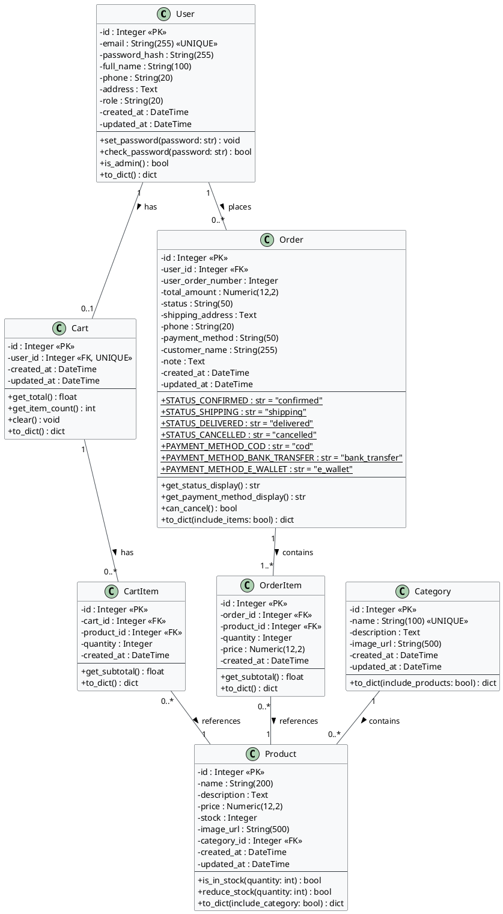

# 📐 Class Diagram - Mini Shop

## 1. Tổng quan

Class Diagram mô tả cấu trúc các lớp (class) trong hệ thống Mini Shop, bao gồm các thuộc tính, phương thức và quan hệ giữa các lớp.

## 2. Class Diagram (PlantUML)



## 3. Mô tả chi tiết

### 3.1. Quan hệ giữa các class

| Quan hệ | Loại | Mô tả |
|---------|------|-------|
| User → Cart | 1:1 | Mỗi user có 1 giỏ hàng |
| User → Order | 1:N | Mỗi user có nhiều đơn hàng |
| Category → Product | 1:N | Mỗi danh mục có nhiều sản phẩm |
| Cart → CartItem | 1:N | Giỏ hàng chứa nhiều mục |
| CartItem → Product | N:1 | Mỗi mục giỏ hàng tham chiếu 1 sản phẩm |
| Order → OrderItem | 1:N | Đơn hàng chứa nhiều sản phẩm |
| OrderItem → Product | N:1 | Mỗi mục đơn hàng tham chiếu 1 sản phẩm |

### 3.2. Design Patterns sử dụng

| Pattern | Áp dụng | Mô tả |
|---------|---------|-------|
| **Factory Pattern** | `create_app()` | Flask Application Factory |
| **Repository Pattern** | SQLAlchemy Models | Truy xuất dữ liệu qua ORM |
| **Blueprint Pattern** | Flask Blueprints | Tổ chức routes theo module |
| **DTO Pattern** | `to_dict()` methods | Chuyển đổi model → JSON |
| **Decorator Pattern** | `@jwt_required`, `@admin_required` | Xác thực và phân quyền |

### 3.3. Bảng tổng hợp Classes

| Class | Thuộc tính | Phương thức | Vai trò |
|-------|-----------|-------------|---------|
| User | 9 | 4 | Quản lý người dùng & xác thực |
| Category | 6 | 1 | Phân loại sản phẩm |
| Product | 9 | 3 | Quản lý sản phẩm |
| Cart | 4 | 4 | Giỏ hàng người dùng |
| CartItem | 5 | 2 | Mục trong giỏ hàng |
| Order | 12 | 4 | Đơn đặt hàng |
| OrderItem | 6 | 2 | Mục trong đơn hàng |

## 4. Sơ đồ ASCII

```
┌──────────────────────┐
│        User          │
├──────────────────────┤
│ - id: Integer        │
│ - email: String      │        ┌──────────────────────┐
│ - password_hash: Str │        │      Category        │
│ - full_name: String  │        ├──────────────────────┤
│ - phone: String      │        │ - id: Integer        │
│ - address: Text      │        │ - name: String       │
│ - role: String       │        │ - description: Text  │
├──────────────────────┤        │ - image_url: String  │
│ + set_password()     │        ├──────────────────────┤
│ + check_password()   │        │ + to_dict()          │
│ + is_admin()         │        └──────────┬───────────┘
│ + to_dict()          │                   │ 1:N
└──┬────────────┬──────┘                   ▼
   │ 1:1        │ 1:N          ┌──────────────────────┐
   ▼            ▼              │      Product         │
┌────────┐  ┌────────────┐    ├──────────────────────┤
│  Cart  │  │   Order    │    │ - id: Integer        │
├────────┤  ├────────────┤    │ - name: String       │
│ - id   │  │ - id       │    │ - price: Numeric     │
│ - uid  │  │ - uid      │    │ - stock: Integer     │
├────────┤  │ - status   │    │ - category_id: FK    │
│+total()│  │ - total    │    ├──────────────────────┤
│+clear()│  │ - payment  │    │ + is_in_stock()      │
│+to_dict│  ├────────────┤    │ + reduce_stock()     │
└──┬─────┘  │+can_cancel │    │ + to_dict()          │
    │ 1:N    │+to_dict()  │    └──────────────────────┘
    ▼        └──┬─────────┘
┌────────┐     │ 1:N                    ▲
│CartItem│     ▼                        │ N:1
├────────┤  ┌────────────┐              │
│- cart  │  │ OrderItem  │──────────────┘
│- prod  │  ├────────────┤
│- qty   │  │ - order_id │
├────────┤  │ - prod_id  │
│+sub()  │  │ - quantity │
└────────┘  │ - price    │
            └────────────┘
```
