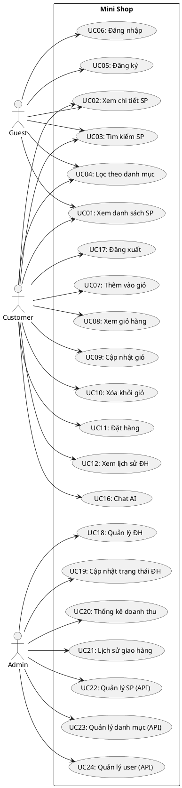

# 📊 Use Case Diagram - Mini Shop

## 1. Actors (Tác nhân)

| Actor | Mô tả |
|-------|-------|
| **Guest** | Người dùng chưa đăng nhập |
| **Customer** | Khách hàng đã đăng nhập |
| **Admin** | Quản trị viên hệ thống |

## 1.1. Trạng thái triển khai (04/2026)

| Nhóm chức năng | Trạng thái |
|----------------|------------|
| Guest/Customer: xem sản phẩm, giỏ hàng, checkout, lịch sử đơn, chatbot | UI + API |
| Admin: dashboard thống kê, quản lý đơn hàng, lịch sử giao hàng | UI + API |
| Admin: CRUD sản phẩm/danh mục, quản lý user | API đã có, UI quản trị chuyên biệt chưa triển khai |

---

## 2. Use Cases

### 2.1. Guest (Khách)
```
┌─────────────────────────────────────────────────────────────┐
│                         MINI SHOP                            │
│                                                              │
│    ┌──────────────┐                                         │
│    │    Guest     │                                         │
│    └──────┬───────┘                                         │
│           │                                                  │
│           ├──────────▶ UC01: Xem danh sách sản phẩm         │
│           │                                                  │
│           ├──────────▶ UC02: Xem chi tiết sản phẩm          │
│           │                                                  │
│           ├──────────▶ UC03: Tìm kiếm sản phẩm              │
│           │                                                  │
│           ├──────────▶ UC04: Lọc sản phẩm theo danh mục     │
│           │                                                  │
│           ├──────────▶ UC05: Đăng ký tài khoản              │
│           │                                                  │
│           └──────────▶ UC06: Đăng nhập                      │
│                                                              │
└─────────────────────────────────────────────────────────────┘
```

### 2.2. Customer (Khách hàng)
```
┌─────────────────────────────────────────────────────────────┐
│                         MINI SHOP                            │
│                                                              │
│    ┌──────────────┐                                         │
│    │   Customer   │                                         │
│    └──────┬───────┘                                         │
│           │                                                  │
│           ├──────────▶ UC01-UC04: (Kế thừa từ Guest)        │
│           │                                                  │
│           ├──────────▶ UC07: Thêm sản phẩm vào giỏ hàng     │
│           │                                                  │
│           ├──────────▶ UC08: Xem giỏ hàng                   │
│           │                                                  │
│           ├──────────▶ UC09: Cập nhật số lượng trong giỏ    │
│           │                                                  │
│           ├──────────▶ UC10: Xóa sản phẩm khỏi giỏ          │
│           │                                                  │
│           ├──────────▶ UC11: Đặt hàng (Checkout)            │
│           │                                                  │
│           ├──────────▶ UC12: Xem lịch sử đơn hàng           │
│           │                                                  │
│           ├──────────▶ UC13: Xem chi tiết đơn hàng          │
│           │                                                  │
│           ├──────────▶ UC14: Cập nhật thông tin cá nhân     │
│           │                                                  │
│           ├──────────▶ UC15: Đổi mật khẩu                   │
│           │                                                  │
│           ├──────────▶ UC16: Chat với AI tư vấn             │
│           │                                                  │
│           └──────────▶ UC17: Đăng xuất                      │
│                                                              │
└─────────────────────────────────────────────────────────────┘
```

### 2.3. Admin (Quản trị viên)
```
┌─────────────────────────────────────────────────────────────┐
│                         MINI SHOP                            │
│                                                              │
│    ┌──────────────┐                                         │
│    │    Admin     │                                         │
│    └──────┬───────┘                                         │
│           │                                                  │
│           ├──────────▶ UC18: Quản lý đơn hàng               │
│           │                                                  │
│           ├──────────▶ UC19: Cập nhật trạng thái đơn hàng   │
│           │                                                  │
│           ├──────────▶ UC20: Xem thống kê doanh thu         │
│           │                                                  │
│           ├──────────▶ UC21: Xem lịch sử giao hàng          │
│           │                                                  │
│           ├──────────▶ UC22: Quản lý sản phẩm (CRUD - API)  │
│           │                                                  │
│           ├──────────▶ UC23: Quản lý danh mục (CRUD - API)  │
│           │                                                  │
│           ├──────────▶ UC24: Quản lý người dùng (API)       │
│                                                              │
└─────────────────────────────────────────────────────────────┘
```

---

## 3. Đặc tả Use Case chi tiết

### UC01: Xem danh sách sản phẩm

| Thuộc tính | Mô tả |
|------------|-------|
| **Actor** | Guest, Customer |
| **Mô tả** | Người dùng xem danh sách các sản phẩm có trong hệ thống |
| **Tiền điều kiện** | Không |
| **Luồng chính** | 1. Người dùng truy cập trang chủ<br>2. Hệ thống hiển thị danh sách sản phẩm (phân trang)<br>3. Mỗi sản phẩm hiển thị: ảnh, tên, giá, đánh giá |
| **Luồng phụ** | - Không có sản phẩm: Hiển thị thông báo "Chưa có sản phẩm" |
| **Hậu điều kiện** | Danh sách sản phẩm được hiển thị |

---

### UC05: Đăng ký tài khoản

| Thuộc tính | Mô tả |
|------------|-------|
| **Actor** | Guest |
| **Mô tả** | Người dùng đăng ký tài khoản mới |
| **Tiền điều kiện** | Người dùng chưa có tài khoản |
| **Luồng chính** | 1. Người dùng click "Đăng ký"<br>2. Hệ thống hiển thị form đăng ký<br>3. Người dùng nhập: Email, Mật khẩu, Họ tên, SĐT<br>4. Hệ thống validate thông tin<br>5. Hệ thống tạo tài khoản và thông báo thành công |
| **Luồng phụ** | - Email đã tồn tại: Thông báo lỗi<br>- Thông tin không hợp lệ: Hiển thị lỗi validation |
| **Hậu điều kiện** | Tài khoản được tạo trong database |

---

### UC06: Đăng nhập

| Thuộc tính | Mô tả |
|------------|-------|
| **Actor** | Guest |
| **Mô tả** | Người dùng đăng nhập vào hệ thống |
| **Tiền điều kiện** | Người dùng đã có tài khoản |
| **Luồng chính** | 1. Người dùng click "Đăng nhập"<br>2. Hệ thống hiển thị form đăng nhập<br>3. Người dùng nhập Email và Mật khẩu<br>4. Hệ thống xác thực thông tin<br>5. Hệ thống tạo JWT token và chuyển về trang chủ |
| **Luồng phụ** | - Sai thông tin: Thông báo "Email hoặc mật khẩu không đúng" |
| **Hậu điều kiện** | Người dùng được đăng nhập, nhận JWT token |

---

### UC07: Thêm sản phẩm vào giỏ hàng

| Thuộc tính | Mô tả |
|------------|-------|
| **Actor** | Customer |
| **Mô tả** | Thêm sản phẩm vào giỏ hàng |
| **Tiền điều kiện** | Đã đăng nhập, sản phẩm còn hàng |
| **Luồng chính** | 1. Người dùng xem chi tiết sản phẩm<br>2. Chọn số lượng và click "Thêm vào giỏ"<br>3. Hệ thống kiểm tra tồn kho<br>4. Thêm vào giỏ hàng và cập nhật badge |
| **Luồng phụ** | - Hết hàng: Hiển thị "Sản phẩm đã hết hàng"<br>- Số lượng > tồn kho: Thông báo lỗi |
| **Hậu điều kiện** | Sản phẩm được thêm vào giỏ hàng |

---

### UC11: Đặt hàng (Checkout)

| Thuộc tính | Mô tả |
|------------|-------|
| **Actor** | Customer |
| **Mô tả** | Người dùng đặt hàng từ giỏ hàng |
| **Tiền điều kiện** | Đã đăng nhập, giỏ hàng có sản phẩm |
| **Luồng chính** | 1. Người dùng click "Thanh toán"<br>2. Hệ thống hiển thị form nhập địa chỉ giao hàng<br>3. Người dùng xác nhận thông tin<br>4. Hệ thống tạo đơn hàng<br>5. Cập nhật tồn kho, xóa giỏ hàng<br>6. Hiển thị thông báo đặt hàng thành công |
| **Luồng phụ** | - Sản phẩm hết hàng trong lúc checkout: Thông báo lỗi |
| **Hậu điều kiện** | Đơn hàng được tạo, giỏ hàng được xóa |

---

### UC16: Chat với AI tư vấn

| Thuộc tính | Mô tả |
|------------|-------|
| **Actor** | Customer |
| **Mô tả** | Chat với AI để được tư vấn sản phẩm |
| **Tiền điều kiện** | Đã đăng nhập |
| **Luồng chính** | 1. Người dùng click icon chat<br>2. Hệ thống mở cửa sổ chat<br>3. Người dùng nhập câu hỏi<br>4. AI phân tích và trả lời dựa trên sản phẩm trong shop<br>5. Gợi ý sản phẩm phù hợp |
| **Hậu điều kiện** | Người dùng nhận được tư vấn từ AI |

---

## 4. Use Case Diagram (PlantUML)



---

## 5. Tài liệu tham khảo

- Tạo diagram online: [PlantUML](https://www.plantuml.com/plantuml/uml)
- Draw.io: [draw.io](https://app.diagrams.net/)
